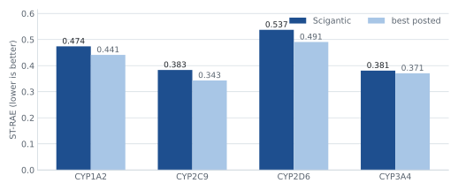

# Using Scigantic for the OpenADMET CYP Inhibition Blind Challenge

Aaron Kanzer · [aaron@scigantic.com](mailto:aaron@scigantic.com)

Predicting pIC50 against four cytochrome P450 isoforms (CYP1A2, CYP2C9, CYP2D6, CYP3A4) for
750 blind compounds, scored by macro-averaged Soft-Threshold Relative Absolute Error.

**Interim leaderboard, regression track: rank 11 of 219.**



## I am not a cheminformatician

I have never run a CYP assay and could not have told you which residues line the CYP2D6 active site. This submission is by a software engineer who purely specializing in information retrieval.

[Scigantic](https://scigantic.com) is a platform that democratizes access to large-scale
archives and to the open-source models worth running against them. The goal here was to see
whether better information retrieval through Scigantic's core infrastructure could let a
newcomer produce competitive results.

## Scigantic's schema cards provide compressed open-source knowledge for approaching the OpenADMET challenge

A public dataset usually comes with documentation, with more information that can be distilled out of the papers referencing such data. When it comes to the raw data in a blob storage bucket (S3, etc.) or via an API, informational retrieval becomes much more complex.

Every dataset in the Scigantic archive carries a schema card, written when the archive is onboarded, as an artifact of a pre-processing traversal and sub-sample. The schema card says what the tables are, what each column means, which file to start from, what the data is not fit for, etc. (think like a cheat sheet for an agent/LLM) The card is handed to the model before the first question, so it starts out knowing the dataset instead of working it out.

It travels as one encoded string, which can be served over MCP alongside the query tools:

```
eyJmb3JtYXQiOiJ2Mi1oeWJyaWQiLCJtb3VudFBhdGgiOiIvbW50L2
FyY2hpdmUiLCJsYXlvdXQiOnsicGF0dGVybiI6Ikh1Z2dpbmdGYWNl
IGRhdGFzZXQgTGl0ZUZvbGQvUERCLCBGVVNFLW1vdW50ZWQgcmVhZC
1vbmx5IGF0IC9tbnQvYXJjaGl2ZS4gQSBjb21wbGV0ZSBtbUNJRiBz
[...more token]
```

Part of the [`LiteFold/PDB`](https://huggingface.co/datasets/LiteFold/PDB) schema card, decoded:

```json
{
  "layout": {
    "pattern": "HuggingFace dataset LiteFold/PDB, FUSE-mounted read-only at /mnt/archive. A complete mmCIF snapshot of the RCSB Protein Data Bank with two tabular indexes over it.\n  data/train-00000-of-00001.parquet + data/test-00000-of-00001.parquet   START HERE. 18 columns, 98,824 rows, ONE ROW PER mmCIF FILE ACTUALLY PRESENT. Carries mmcif_path, title, classification, organism, resolution, experimental method and split bucket, so you never have to touch a structure file to select entries.\n  metadata/entries_idx.parquet   the FULL upstream RCSB index, 252,816 rows, 11 columns. 153,992 of its entries have NO file in this ...",
    "example": "data/train-00000-of-00001.parquet"
  },
  "rowCount": "98,824 entries with files present (data/*.parquet). 99,993 mmCIF files, 31.1 GB. metadata/entries_idx.parquet holds 252,816 upstream entries, 153,992 of them fileless here. Resolution known ...",
  "columns": [
    {
      "name": "pdb_id",
      "type": "string  (4-char lowercase code, e.g. \"1tqn\". The join key for everything)"
    },
    {
      "name": "mmcif_path",
      "type": "string  (mmcif/<pdb_id[1:3]>/<pdb_id>.cif.gz — SHARDED, see caveats)"
    },
    {
      "name": "mmcif_file_size_bytes",
      "type": "int64  (gzipped size; median ~180 KB, largest exceed 40 MB)"
    },
    {
      "name": "mmcif_blob_id",
      "type": "string  (git-lfs blob sha, not a hash of the decompressed file)"
    },
    {
      "name": "pdb_url / rcsb_download_url",
      "type": "string  (upstream links; the local mount has the same bytes)"
    },
    "...[more columns]"
  ],
  "caveats": [
    "THE PATH IS SHARDED: mmcif/<pdb_id[1:3]>/<pdb_id>.cif.gz. CYP3A4 entry 1tqn is at mmcif/tq/1tqn.cif.gz; CYP2D6 entry 3tbg is at mmcif/tb/3tbg.cif.gz. The flat path mmcif/1tqn.cif.gz does not exist. Verified on 4,000 sampled rows.",
    "TITLE IS THE ONLY PLACE THE PROTEIN IS NAMED, AND ONE PATTERN IS NEVER ENOUGH. There is no target, gene or UniProt column, and one enzyme family appears under several spellings. Measured on X-ray entries under 2.5 A: cytochrome-p450 matches 184, p450 matches 255, and adding a CYP<digit> pattern ...",
    "...[more caveats]"
  ],
  "sampleHeaders": [
    {
      "key": "data/test-00000-of-00001.parquet",
      "encoding": "hex",
      "truncatedAt": 512,
      "bytes": "50415231150415f0db091596ae034c15be9b01150012000028b52ffda0f8360100fd5b03ae5a8804151a8015ea0140db ..."
    }
  ],
  "accessHints": [
    "...[runnable snippets]"
  ],
  "other_awesome_things...": [...]
}
```

For example, three things that this example schema card carries that an initial traversal of the
bucket's files do not. The file path is sharded: CYP3A4's entry `1tqn` is at
`mmcif/tq/1tqn.cif.gz`, keyed on characters two and three of the id, and the flat path does not
exist. There are two index tables covering different things, one with 98,824 rows, one per file
actually present, and one with 252,816, the full upstream PDB, of which 153,992 entries have no
file here, so counting from the wrong one overstates the archive 2.56x. And of two date columns,
`accession_date` is US `MM/DD/YY` text and sorts wrongly.


### What the schema card improves

The goal is to improve **model efficiency. This includes less API calls,  less tokens, improve round-trip latency, and better activation of each LLM or fine-tuned model**: how many times the assistant hits the model endpoint to answer one question. A model can't always answer from memory (e.g. the initial prompt too), so traditionally the model reads files and runs code, with every step carrying the whole conversation so far. Thus, fewer calls means less latency and less spend.

Five questions against [`LiteFold/PDB`](https://huggingface.co/datasets/LiteFold/PDB), the PDB mmCIF mirror, asked once with the schema card vs. once with no schema card:


| question                                                     | LLM API calls, with schema card | LLM API calls, no schema card | wall clock, with schema card | wall clock, no schema card |
| ------------------------------------------------------------ | ------------------------------- | ----------------------------- | ---------------------------- | -------------------------- |
| Which entries are in the test split, and how was it decided? | **5**                           | 9                             | **20s**                      | 67s                        |
| How many structure files, totalling how many bytes?          | **3**                           | 5                             | **16s**                      | 18s                        |
| Find the cytochrome P450 X-ray structures better than 2.5 Å  | **5**                           | 6                             | **23s**                      | 70s                        |
| Give me the 10 oldest entries by deposition date             | 5                               | 5                             | **22s**                      | 26s                        |
| Open the mmCIF for 1TQN and report resolution and chains     | 9                               | **5**                         | 31s                          | **23s**                    |
| **total**                                                    | **27**                          | **30**                        | **112s**                     | **204s**                   |


To examine closer, one of the five questions has a specific answer. The P450 count is 427. With the schema card, the LLM returned 427; without it, 118, and 426 on an earlier run. `title` is free text and the family appears as "cytochrome P450", "P450" and "CYP3A4", so an unguided search could pick a different pattern each time.

The last question above does happen to favor no schema card. The schema card includes a worked example for opening one entry and the model follows it further than the question needs. Both answers were correct. Thus, some pitfalls/progress to make.

What's exciting here is that Scigantic's schema card approach here can be generalized across different scientific domains and large-scale archives. Similar preliminary benchmarking was done on the following examples below, with a massive improvement in round-trip latency.


| archive                                                                                                               | domain                      | scale                   | schema calls, card | schema calls, no card | time, card | time, no card |
| --------------------------------------------------------------------------------------------------------------------- | --------------------------- | ----------------------- | ------------------ | --------------------- | ---------- | ------------- |
| [`met-office-cmip6`](https://registry.opendata.aws/met-office-cmip6/)                                                 | decadal climate hindcasts   | 438,971 objects, 78 TB  | 55                 | 55                    | **830s**   | 833s          |
| [`nasa-lunar-fm-bench`](https://registry.opendata.aws/som-bench/)                                                     | planetary remote sensing    | 47.6M objects, 44 TB    | **44**             | 75                    | **240s**   | 795s          |
| [`sea-ad-single-cell-profiling`](https://registry.opendata.aws/allen-sea-ad-atlas/)                                   | single-cell transcriptomics | 726,870 objects, 269 GB | **27**             | 58                    | **238s**   | 885s          |
| [`LiteFold/PDB`](https://huggingface.co/datasets/LiteFold/PDB)                                                        | protein structures          | 99,993 files, 31 GB     | **27**             | 30                    | **111s**   | 204s          |
| [`openadmet/Octant_CYP_...`](https://huggingface.co/datasets/openadmet/Octant_CYP_inhibition_reactivity_blog_release) | ADMET assay                 | 6 files, 7 MB           | **38**             | 46                    | **168s**   | 195s          |


For specifics, on the 44 TB lunar corpus the schema card halved the work, 44 calls against 75 and 240 seconds against 795, for the same answers. On Octant, six files with a documented schema, the margin is noise, but expected since the data is small.   
  
SEA-AD saw incredible results for information retrieval, halving the model calls, and reducing latency by ~75%  
  
These schema cards could even be more thorough. This is just the initial proof that shows they properly activate the LLMs for appropriate answers.

## Five open-source libraries developed thus far for cheminformatics information retrieval

The schema cards are great for information retrieval against blob storage. For cheminformatics, the schema cards also exposed certain issues regarding comparison of large-scale blob storage archives vs. API-based archives.  
  
To assist with potentially a better "zero-shot"-ish approach moving forward, Scigantic published the following libraries, all public via PyPI. Each wraps a weekly-refreshed parquet mirror on S3 with a live API fallback, so a public database becomes an import rather than a download-and-reformat project. Thus, better inclusion for agentic loops.

For example, if one prompted an agent for CYP pIC50 records, the agent hitting a public REST API has to guess endpoints, paginate, and parse whatever comes back. With these libraries, it's now one typed call returning a dataframe, so the retrieval step stops being the part that fails or becoming expensive.


| library                                                                     | what it gives you                                                                                                                                 |
| --------------------------------------------------------------------------- | ------------------------------------------------------------------------------------------------------------------------------------------------- |
| [`scigantic-chembl`](https://github.com/Scigantic/scigantic-chembl)         | Curated ChEMBL bioactivity, including the pIC50 records for all four isoforms that supply most of the auxiliary training signal.                  |
| [`scigantic-pubchem`](https://github.com/Scigantic/scigantic-pubchem)       | The compound identifier registry. Resolves names, InChIKeys and SMILES to CIDs, which is what allows five differently-keyed sources to be joined. |
| [`scigantic-comptox`](https://github.com/Scigantic/scigantic-comptox)       | EPA CompTox chemistry and toxicity endpoints, used as auxiliary heads rather than direct labels.                                                  |
| [`scigantic-bindingdb`](https://github.com/Scigantic/scigantic-bindingdb)   | Measured binding affinities (Ki, Kd, IC50, EC50), for checking CYP potency against an independent deposit.                                        |
| [`scigantic-surechembl`](https://github.com/Scigantic/scigantic-surechembl) | Patent-extracted structures and their activity context, the only source reaching chemistry not yet in journals.                                   |


## Leveraging Scigantic's core infrastructure for fine-tuning  


Once properly identifying a proper information retrieval pipeline, Scigantic can provision compute to perform fine-tuning. The same compute that powers the notebooks on the site can be extended to a data pipeline in the background.  
  
The OpenADMET organizers supplied almost 5,000 compounds with scored labels. That is not enough to fine-tune on, so Scigantic's new public libraries above were used to assemble a wider table: **~32K compounds and 180K+ labels across 26 endpoints**, from six sources.


| source                                           | endpoints | labels | compounds |
| ------------------------------------------------ | --------- | ------ | --------- |
| Organizers, scored direct-inhibition pIC50       | 4         | 6,525  | 4,905     |
| Organizers, single-concentration log2FC          | 4         | 17,500 | 4,375     |
| Organizers, pIC50 under a second assay condition | 4         | 6,538  | 4,904     |
| Retrieved, ChEMBL pIC50                          | 5         | 56,705 | 24,921    |
| Retrieved, Veith qHTS AC50                       | 4         | 15,070 | 7,362     |
| Retrieved, qHTS maximum response                 | 5         | 80,665 | 16,133    |


**The scored labels are 3.6% of the table.** The rest is never scored and never predicted at
test time. Training against it is what stops a 4,900-compound fine-tune from memorizing.

### The schema cards helping with a bit of data clean-up

Pulling public data for a blind challenge raises an obvious question. Does every external pull match against the held-out set on canonical SMILES and InChIKey skeleton, and is there anything that matches is dropped before training?  
  
To get more technical (and a bit past my expertise), that question above is the reason that Scigantic's current submission is done on structure rather than on compound name. One held-out compound did turn up in an early table, under a screening accession that looked nothing like its challenge identifier, carrying auxiliary screening values rather than a scored measurement. Name-based checks had all passed. It is listed in an exclusion file, dropped from every table built since, and verified absent from the one used here.

Two details there are retrieval decisions rather than modeling ones. The ChEMBL block covers
five isoforms including CYP2C19, which the challenge does not score at all, because a
correlated fifth task improves the four that are scored. And the qHTS maximum-response block
is the largest single source at 80,665 labels: it is not a potency value but the raw screening
response, which carries whether a compound does anything at all, and that turns out to be
worth more rows than any curated endpoint.

The fine-tuning itself: 364 SageMaker training jobs on one container image,
`scigantic-finetune-job`. Twelve members reach the final stack, drawn from two backbones.

**[CheMeleon](https://github.com/JacksonBurns/chemeleon)** supplies eight of the twelve. It is a molecular foundation model whose
pretrained representation is fine-tuned here as a multi-task regressor over all 26 endpoints
at once, which is what lets the auxiliary labels reach the four scored ones. The eight differ
in which auxiliary heads they carry, the embedding width, and whether the credible interval is
fed in as an input.

**[Chemprop](https://github.com/chemprop/chemprop)**, a directed message-passing network over the molecular graph, supplies the other
four, including one trained to predict the interval rather than the point value. Mordred
descriptors with gradient-boosted trees sit alongside as a non-neural check that the graph
models are adding something.

MolFormer, ChemBERTa and Uni-Mol were fine-tuned and measured but did not earn a place in the stack. Most of the 364 jobs produced nothing usable, which is the cost of searching without domain intuition to prune it. Fortunately, the cost was very, very minimal.

## The other notable decision

The metric forgives near misses. Each compound's measured value comes with a margin of
uncertainty, and a prediction inside that margin is treated as correct. At CYP1A2 the margin is
about 0.17 either side, and 23% of our predictions land inside it and cost nothing.

Squared error penalizes for those misses although the metric does not. So the twelve member weights are fitted to the competition metric itself, on held-out folds, rather than to squared error. After fitting, the column is rescaled to its pre-fit mean and standard deviation, which stops the search from shifting or squashing the whole column to lower training loss without improving any single prediction.

## Next steps

Whether or not Scigantic wins the OpenADMET challenge (or makes the podium) is TBD. What's exciting is that the method of information retrieval that Scigantic provides is working. These are results based off of no proprietary data, access to HPC clusters, or subject matter experts prompting. 

